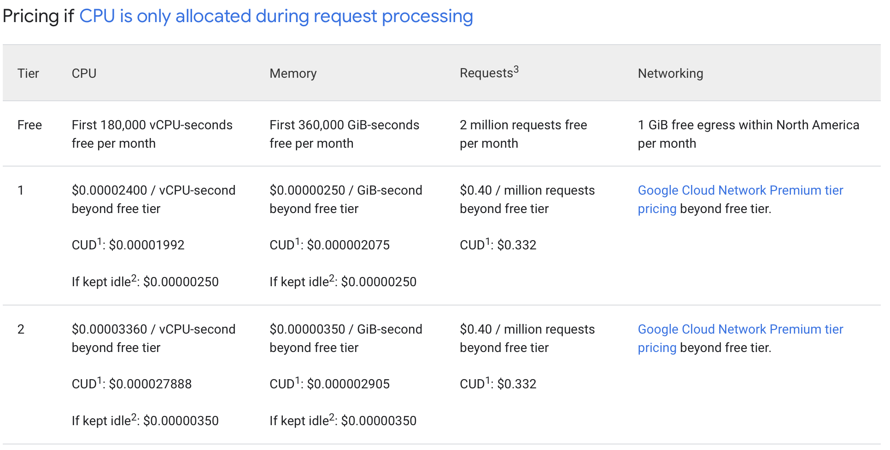
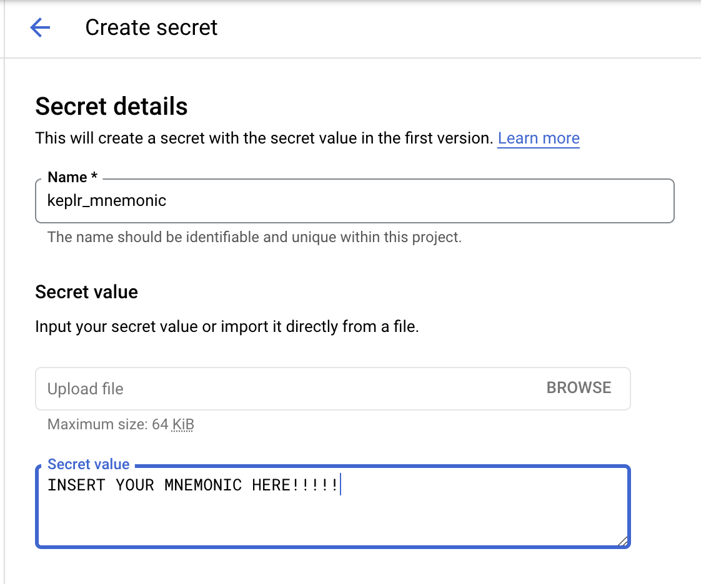
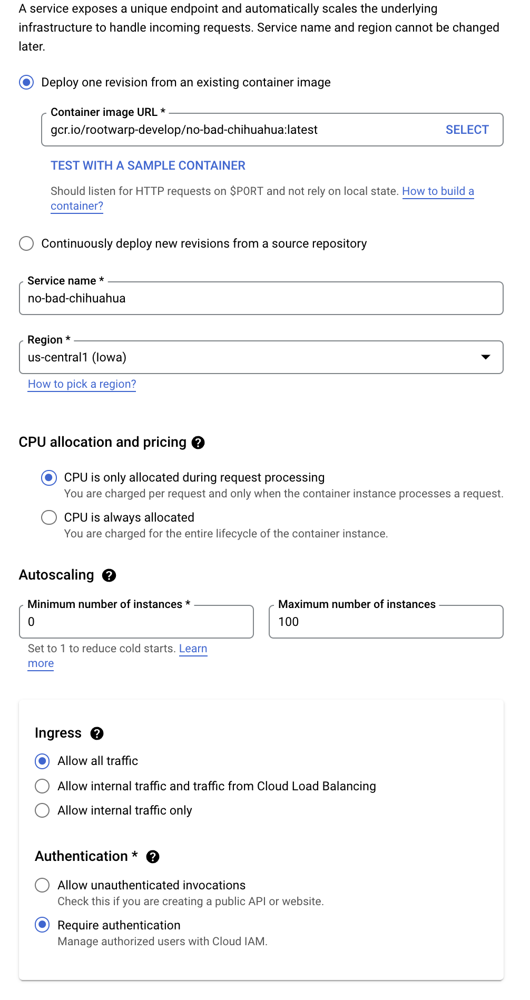
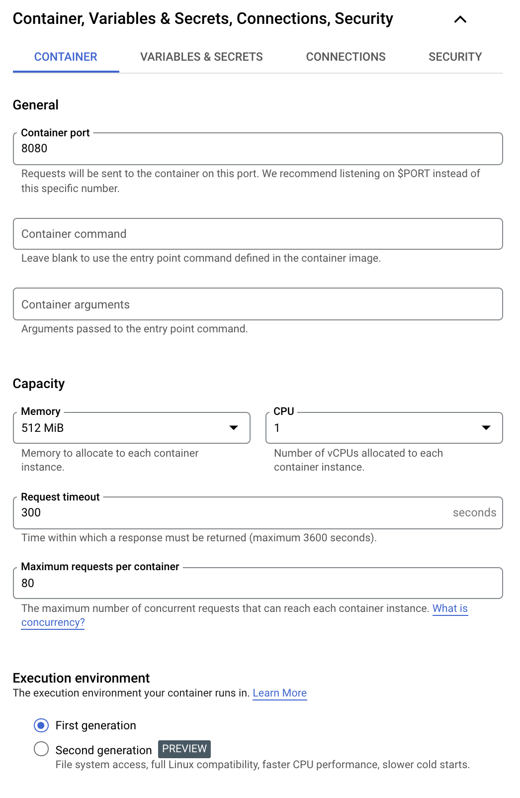
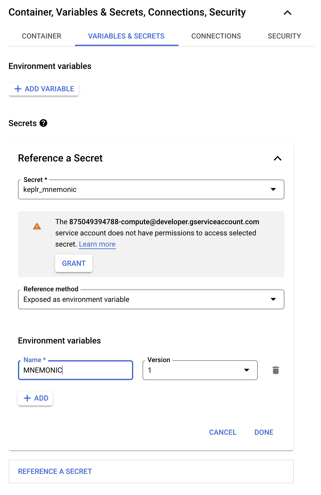
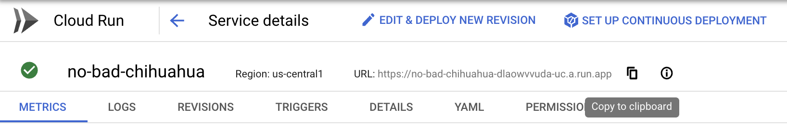
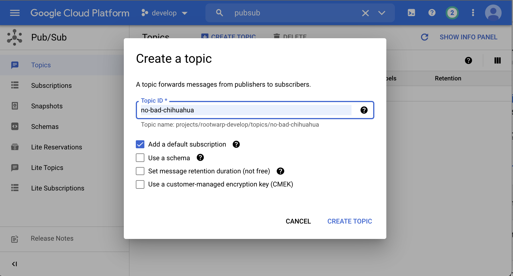
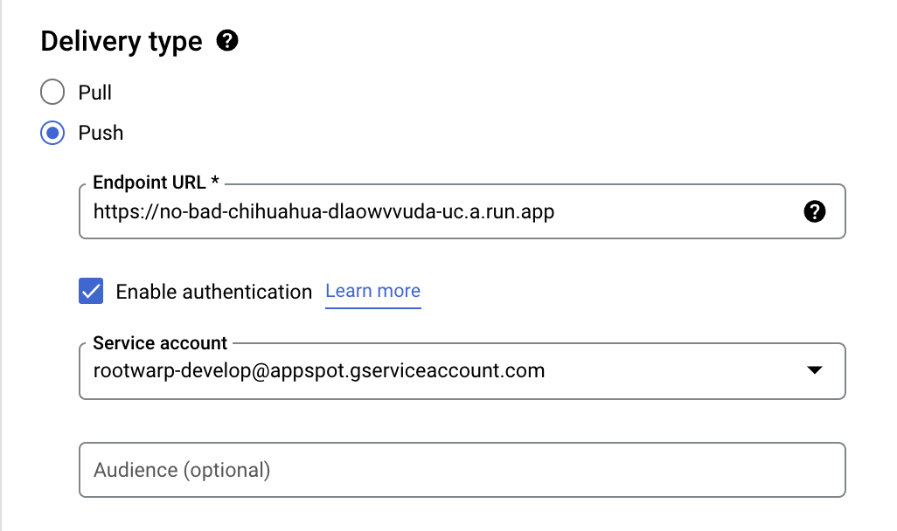
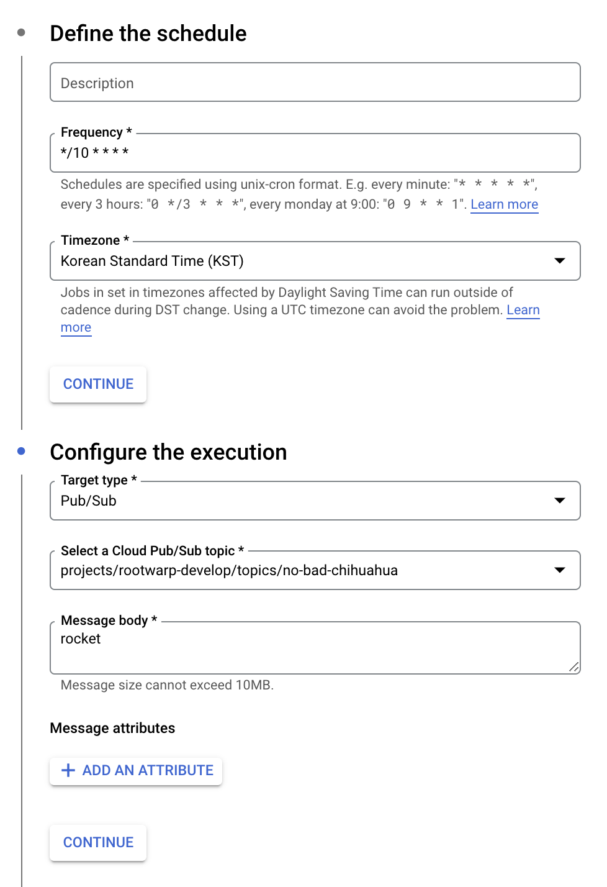

# NO BAD CHIHUAHUA

TBD

## Deploy to Google Cloud Run

Managed version of Cloud Run is almost free for personal uses.

### Step 1: Create Secret

Open [Google Cloud Console](https://console.cloud.google.com) and login.
Then move to `Secret Manager`.

You can find `Secret Manager` on `Security` menu which is on Navigation menu.

### Step 2: Deploy

Move to `Cloud Run` from Navigation menu and push `Create Service` on top of screen.

1. For `Container image URL`, insert `gcr.io/rootwarp-develop/no-bad-chihuahua:latest`.
2. Region: Leave default.
3. CPU allocation and pricing should be **CPU is only allocated during request processing**.
4. Minimum number of instances should be **ZERO**.
5. Ingress: **Allow all traffic**
6. Authentication: **Require authentication**.

Next, open *Container, Variables & Secrets ......* and select *Container*.

For here, memory size should be larger than 512MB.

Next, select *Variables & Secrets*.

1. Secret should be your secret entry which is created on `Step 1`.
2. Choose `Exposed as environment variable.
3. you MUST use `MNEMONIC` as name of environment variable.

Push `Deploy` button if all confirmed.

If the service deployed sucessfully, you can find random generate URL like below.

### Step 3: Add Pubsub

Move to `PubSub`.

Create topic with **Add a default subscription**.

After the topic created, you can find a subscription which is created automatically.

Select it and edit.

1. Delivery type MUST be **Push**
2. Set `Endpoint URL` as your service's URL which is generated on `Step 2`.
3. Enable authentication and choose one.

### Step 4: Add Scheduler

Move to `Cloud scheduler`.

1. Frequency: `*/10 * * * *`
2. Target Type: `Pub/Sub`
3. Select a Cloud Pub/Sub topic: Choose the topic that you created `Step 3`.
4. Message body: Add any value.

